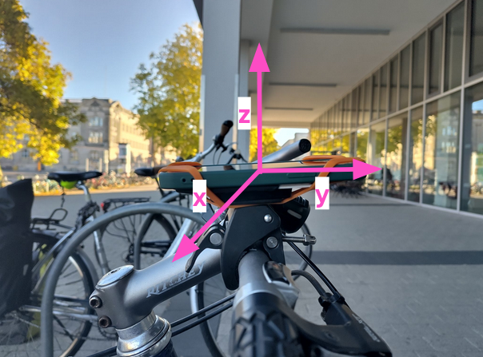

# PHLEI - Hackathon on Cycling Data

**P**otsdam 
**H**olperfrei -
**L**ocker
**E**rfahrbare
**I**nfrastruktur

## What we do
Measure, analyze and visualize the quality of bike paths based on data collected by the acceleration sensors of smartphones.  

## How we do it
We collect data with the acceleration sensor of a modern smartphone using [Phyphox](https://phyphox.org/). The smartphone is mounted to a bikes handlebar. It is important that the phone is placed parallel to the ground, since we use the acceleration on the y-axis to estimate the roughness of the surface. 

The experiment used to collect all needed measurements can be found in `experiments.phyphox`

We import the data and calculate the Biking Road Roughness Index (BRI) using `data-import.py`. The data can be visualized using `dashboard.py`.

We base our calculations of the BRI on [Lee, Dong-youn, et al. "Development of a Bicycle Road Surface Roughness and Risk Assessment Method Using Smartphone Sensor Technology." Sensors 25.11 (2025): 3520.](https://www.mdpi.com/1424-8220/25/11/3520)

## How can you execute this 

This repository contains two example datasets collected with Phyphox, `data/good_path.zip` and `data/bad_path.zip`.
To convert these into KML to use with the dashboard or Google Earth, run
```bash
./data-import.py --zip_file data/good_path.zip
./data-import.py --zip_file data/bad_path.zip
```
This will generate `data/good_path.zip.kml` and `data/bad_path.zip.kml`.
For convenience, the generated KML files for the example data are also included in the repository.
Afterwards, run `dashboard.py` and open the printed link in your browser.

Of course, you can collect your own dataset using the provided Phyphox experiment.

## What data is collected
To calculate the BRI we need measurements linear acceleration on the z-axis and a GPS track. 
